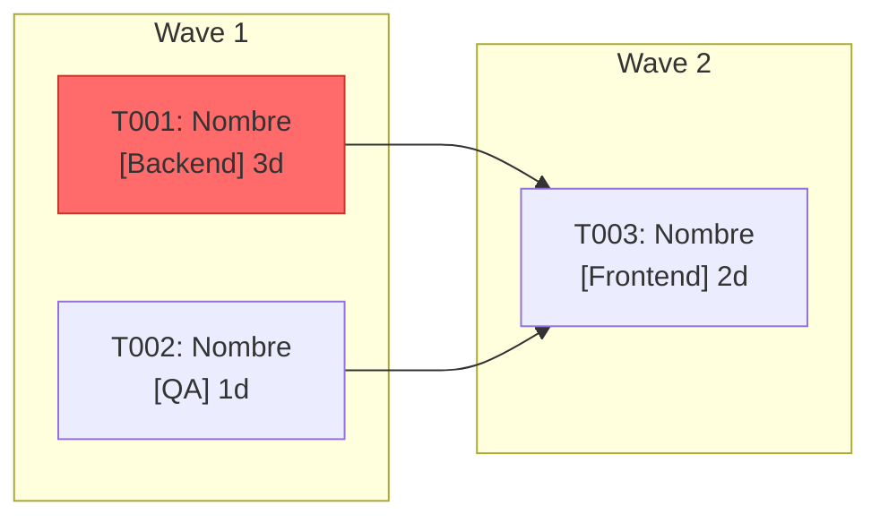

Lee el fichero de tareas indicado, analiza dependencias y bloqueos, prioriza el trabajo y distribúyelo entre equipos para minimizar el TTM:

$ARGUMENTS

---

## Input esperado

Acepta cualquiera de estos formatos. Si el fichero no sigue el esquema exacto, infiere la información disponible y señala qué campos faltan.

### Markdown
```markdown
## Tarea: [ID] Nombre de la tarea
- **Equipo:** Backend / Frontend / QA / DevOps / ...
- **Estimación:** Xd (días) o Xh (horas)
- **Depende de:** [ID_otra_tarea], [ID_otra_tarea]
- **Prioridad:** Alta / Media / Baja
- **Descripción:** ...
```

### JSON
```json
[
  {
    "id": "T001",
    "nombre": "Nombre de la tarea",
    "equipo": "Backend",
    "estimacion_dias": 3,
    "depende_de": ["T002"],
    "prioridad": "Alta",
    "descripcion": "..."
  }
]
```

---

## Comportamiento

### Fase 1 — Análisis del grafo de dependencias
- Construye el grafo dirigido de tareas (nodos) y dependencias (aristas)
- Detecta **ciclos** (dependencias circulares) y los reporta como errores bloqueantes
- Identifica el **camino crítico**: la secuencia de tareas encadenadas con mayor duración total
- Detecta tareas **huérfanas** (sin dependencias ni dependientes) que podrían paralelizarse de inmediato

### Fase 2 — Identificación de bloqueos y riesgos
Para cada dependencia, evalúa:
- ¿Depende de un equipo distinto? → Riesgo de coordinación inter-equipo
- ¿La tarea bloqueante tiene estimación alta o prioridad baja? → Riesgo de retraso en cascada
- ¿Hay tareas sin equipo asignado o sin estimación? → Señalarlas como incompletas

Clasifica cada bloqueo:
| Tipo | Descripción |
|------|-------------|
| **BLOQUEANTE** | Sin esta tarea, N otras no pueden empezar |
| **RIESGO ALTO** | Depende de otro equipo con estimación >3d |
| **GAP** | Información insuficiente para planificar |

### Fase 3 — Priorización y asignación
Calcula la prioridad efectiva de cada tarea combinando:
- Prioridad declarada
- Número de tareas que desbloquea (fan-out)
- Posición en el camino crítico

Ordena el backlog resultante por prioridad efectiva y asigna oleadas de trabajo (Wave 1, Wave 2, ...) respetando:
- Las dependencias (nada puede empezar antes de que sus bloqueantes estén resueltos)
- La capacidad paralela por equipo (no sobrecargar un equipo con más de lo que puede hacer en paralelo)

---

## Output

### 1. Tabla de tareas priorizadas

| ID | Tarea | Equipo | Estimación | Prioridad Efectiva | Wave | Depende de | Bloquea a | Alertas |
|----|-------|--------|------------|-------------------|------|-----------|-----------|---------|
| ...| ...   | ...    | ...        | Alta / Media / Baja | W1 | ...       | ...       | ⚠️ / ✅ |

### 2. Diagrama de flujo (Mermaid)

Genera un diagrama `flowchart LR` con:
- Nodos coloreados por equipo
- Aristas que representan dependencias
- Nodos del camino crítico marcados con borde rojo
- Agrupación por Wave mediante `subgraph`



### 3. Resumen ejecutivo

- **Duración estimada total** (camino crítico): Xd
- **Tareas en camino crítico**: lista de IDs
- **Bloqueos identificados**: lista con descripción y recomendación de acción
- **Recomendación**: qué atacar primero para reducir el TTM y por qué

---

## Notas de uso

- Si no se especifican equipos, agrupa por área funcional inferida del nombre/descripción.
- Si hay tareas sin estimación, usa T-shirt sizing (S=1d, M=3d, L=7d) e indícalo explícitamente.
- Si el fichero tiene más de 30 tareas, genera primero el resumen ejecutivo y pregunta si se quiere el diagrama completo o por subconjunto.
